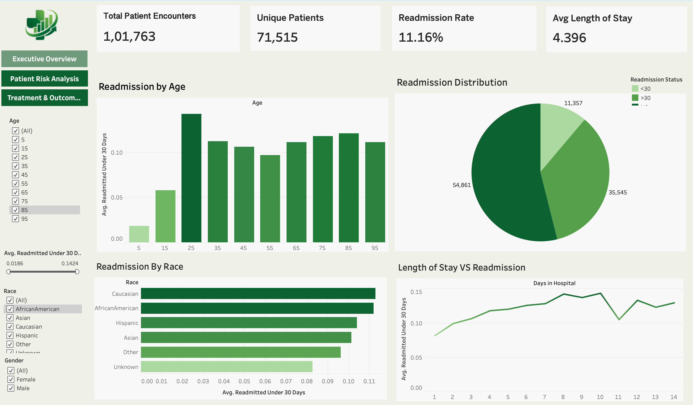
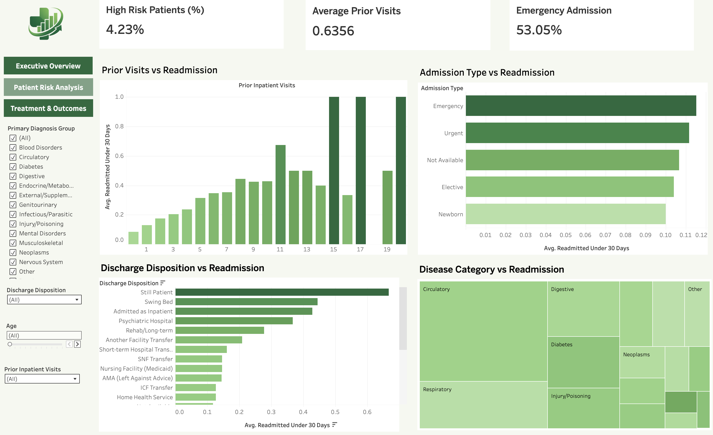
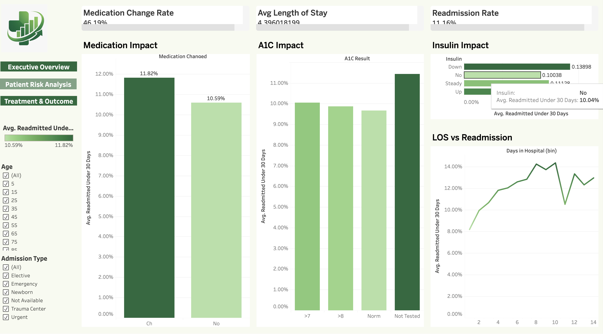

# SectionC_G-10_DiabetesReadmissionAnalysis
Newton School of Technology | Data Visualization & Analytics | Capstone 2

## Project Overview
| Field | Details |
| :--- | :--- |
| **Project Title** | Diabetes Readmission Analysis: Predicting 30-Day Hospital Returns |
| **Sector** | Healthcare |
| **Team ID** | G-10 |
| **Section** | C |
| **Faculty Mentor** | Archit Raj |
| **Institute** | Newton School of Technology |
| **Submission Date** | April 29, 2026 |

## Team Members
| Role | Name | GitHub Username |
| :--- | :--- | :--- |
| **Project Lead** | Dhanvin Vadlamudi | Dhanvin1520 |
| **Tableau Architect** | Ayush Mittal | mittalayushh |
| **Data Engineer** | GARGI SRIVASTAVA | gigibyte2024 |
| **Statistical Analyst** | tanish Garg | tnshgarg |
| **EDA Specialist** | Sumit Yadav | sumit316-glitch |
| **Documentation & QA** | LAKSHYA | Lakshyalamba |

## Business Problem
Diabetic patients represent a significant portion of hospital admissions, and readmission rates remain a critical challenge for healthcare providers. This project analyzes a decade of clinical data from 130 US hospitals to identify factors contributing to patient readmissions within 30 days. By identifying high-risk characteristics and treatment patterns, hospital administrators can optimize discharge planning and post-care strategies to improve patient outcomes and reduce healthcare costs.

### Core Business Question
How can patient demographics, medication changes, and hospital treatment history be leveraged to accurately predict and reduce 30-day readmission rates in diabetic patients?

### Decision Supported
This analysis enables hospital management to identify high-risk patient segments prior to discharge and implement targeted intervention strategies, such as specialized follow-up care or medication adjustments, to prevent avoidable readmissions.

## Data Cleaning & ETL Methodology
The cleaning process was designed to transform raw clinical records into a high-fidelity dataset focused on **30-day readmission prediction**. 

Key steps included:
1. **Target Variable Standardisation**: The original `readmitted` column (NO, >30, <30) was recoded into a binary `readmit_30d` target. This aligns directly with our primary KPI of reducing early hospital returns.
2. **Clinical Missingness Handling**: Placeholders like `?` were converted to standard `NaN`. We dropped high-missingness columns (`weight`, `payer_code`, `medical_specialty`) to remove noise while retaining demographic integrity.
3. **Age Encoding**: Transformed categorical age bins (e.g., `[50-60)`) into numerical midpoints (`55`). This allows for statistical correlation analysis between age and the probability of readmission.
4. **Data Quality Filtering**: Removed records with `Unknown/Invalid` gender and imputed `race` as 'Other' to ensure robust demographic segmentation without losing data volume.

For the full implementation, see `notebooks/02_cleaning.ipynb` or run `python scripts/etl_pipeline.py`.

## Dataset
| Attribute | Details |
| :--- | :--- |
| **Source Name** | UCI Machine Learning Repository |
| **Direct Access Link** | [Diabetes 130-US Hospitals Dataset](https://archive.ics.uci.edu/dataset/296/diabetes+130-us+hospitals+for+years+1999-2008) |
| **Row Count** | 101,766 |
| **Column Count** | 50 |
| **Time Period Covered** | 1999 to 2008 |
| **Format** | CSV |

### Key Columns Used
| Column Name | Description | Role in Analysis |
| :--- | :--- | :--- |
| `readmitted` | Patient readmission status (NO, >30, <30) | **Target Variable** (KPI 1) |
| `time_in_hospital` | Number of days between admission and discharge | **Target Variable** (KPI 2) |
| `age` | Age interval of the patient | Segmentation / Filter |
| `number_inpatient` | Number of inpatient visits of the patient in the year preceding the encounter | Predictor / Segment |

## KPI Framework
| KPI | Definition | Formula / Computation |
| :--- | :--- | :--- |
| **30-Day Readmission Rate (%)** | Percentage of patients readmitted within 30 days of discharge | `(Count of patients with readmitted = '<30') / (Total Admissions) * 100` |
| **Average Length of Stay (Days)** | Average time patients spend in the hospital | `Average(time_in_hospital)` |

## Tableau Dashboard
*Decision support suite for hospital readmission risk management.*

### 🖥️ Dashboard Gallery
| Executive Overview | Patient Risk Analysis | Treatment & Outcomes |
| :---: | :---: | :---: |
|  |  | 

- **Executive View**: Tracks real-time 30-day readmission rates vs. age and race cohorts.
- **Operational View**: Allows discharge planners to drill down into diagnosis-specific risk factors.
- **Outcome Analysis**: Visualizes the correlation between medication changes and patient stability.
- **Dashboard URL**: [Interactive Executive Overview](https://public.tableau.com/app/profile/ayush.mittal4873/viz/DVACapstoneDiabetesReadmissionAnalysis_v2025_3/Dashboard_Executive_Overview?publish=yes)

## Repository Structure
```
SectionC_G-10_DiabetesReadmissionAnalysis/
|-- README.md
|-- data/
|   |-- raw/                         # Original dataset (diabetic_data.csv)
|   `-- processed/                   # Cleaned output from ETL pipeline
|-- notebooks/
|   |-- 01_extraction.ipynb
|   |-- 02_cleaning.ipynb
|   |-- 03_eda.ipynb
|   |-- 04_statistical_analysis.ipynb
|   `-- 05_final_load_prep.ipynb
|-- scripts/
|   `-- etl_pipeline.py
|-- tableau/
|   |-- screenshots/                 # Key dashboard views
|   `-- dashboard_links.md           # Interactive dashboard URL
|-- reports/                         # Final deliverables (PDF/LaTeX)
|-- docs/
|   `-- data_dictionary.md           # Dataset schema and column definitions
|-- DVA-oriented-Resume/             # Team career assets
`-- DVA-focused-Portfolio/            # Project showcase links
```

## Tech Stack
| Tool | Purpose |
| :--- | :--- |
| **Python** | ETL, Cleaning, and Statistical Analysis |
| **Tableau Public** | Dashboard design and visualization |
| **GitHub** | Version control and collaboration |

## Contribution Matrix
| Team Member | Dataset | ETL | EDA | Stats | Tableau | Report | PPT |
| :--- | :---: | :---: | :---: | :---: | :---: | :---: | :---: |
| **Dhanvin Vadlamudi** | ✅ | ✅ | ✅ | ✅ | | ✅ | ✅ |
| **Ayush Mittal** | ✅ | ✅ | | | ✅ | | |
| **GARGI SRIVASTAVA** | ✅ | | | | ✅ | | |
| **tanish Garg** | ✅ | | | | ✅ | | |
| **Sumit Yadav** | ✅ | | | | | ✅ | |
| **LAKSHYA** | ✅ | | | | | | ✅ |

**Declaration:** We confirm that the above contribution details are accurate and verifiable through GitHub Insights, PR history, and submitted artifacts.

**Team Lead Name:** Dhanvin Vadlamudi  
**Date:** April 29, 2026

## Academic Integrity
All analysis, code, and recommendations in this repository are the original work of the team listed above. Free-riding is tracked via GitHub Insights and pull request history. Any mismatch between the contribution matrix and actual commit history may result in individual grade adjustments.
